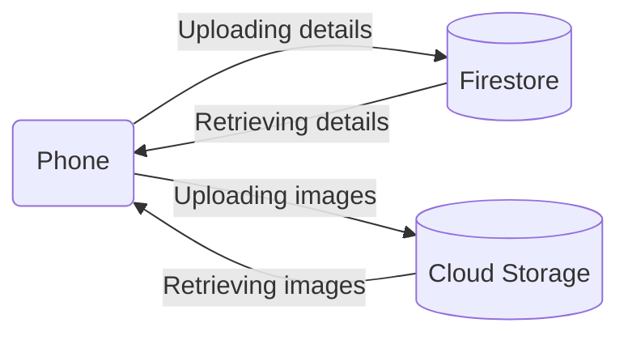

# StockTake
## About
StockTake is an android app designed to aid with both intra and inter organisational inventory management / sharing, specifically suited to the SUTD context. It allows administrators of organisations to keep track of inventory as it is loaned out members, ensuring accountability for items lost or damaged as it exchanges hands. Additionally, items can be flagged for inter-organisational sharing, allowing individuals outside of the organisation to put loan requests, reducing overall wastage. 

### SUTD Context
This applies to the SUTD context in the form of 5th rows and their inventories. Individually, 5th rows often lack the funds necessary to organise events, particularly if events aimed at the wider school population (and hence requiring scale). Collectively however, 5th rows likely have the resources necessary if only resources were pooled. 

To enable this pooling and to reduce redundant purchases, 5th rows can opt to share resources - the collaborative nature of the school's culture plays well into this. Identity and access management is done through the student cards - NFC readers on the phone are used to authenticate loans. 

### How to Loan Items
For loaning of items, two parties (separate devices) are involved: the club owner​ and the ​loanee.​
1. The loanee contacts the club owner via their Telegram handle shown in the details of the item.
2. Upon meeting, the club owner scans the QR code associated with the item of interest.
3. The club owner enters the quantity of the item the loanee wants to loan out and the relevant return date.
4. The club owner will be prompted to scan the loanee’s card. The loanee should then scan their NFC-enabled ID card tied to their account during registration onto the club owner’s device.

## Tech Stack

The key technologies used in the app are as follows: 

### 1. Firebase
All loans and user information are stored in Firebase's Cloud Firestore, a NoSQL database that enables both expressive querying and realtime updates. Images however, are kept in Cloud Storage for Firebase. 

### 2. QR Codes 
These are used to uniquely identity items in the inventory. Whenever an item is added to the app, a QR code will be automatically generated. This can be downloaded, printed, and placed on items for easy identification. 

### 3. NFC
When registering an account, users will be prompted to place their SUTD card at the back of the phone, associating their account with their card via NFC. Whenever a loan is requested, the loanee will present their card to the organisation admin, who will tap the card at the back of their phone. This ensures that the loan is associated with the correct user. 

### 4. The App
The app is done in Android Java, and must be installed on an NFC enabled android phone. 

### System Overview

<!-- generated by mermaid compile action - START -->

  
Mermaid markup

<!-- generated by mermaid compile action - END -->
